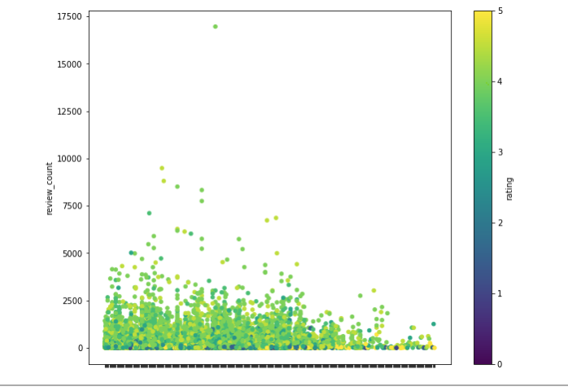
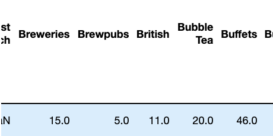
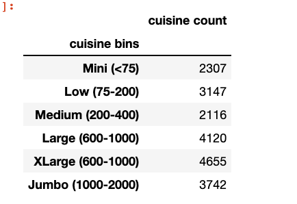

# Stars of LA
## Yelp rating stars analyzed for Los Angeles
Munging, expunging, normalization and plotting extracted data from Yelp API using Python Pandas

### About
Interactive map plot of Los Angeles, CA restaurants that appear on Yelp. The data was retrieved by utilizing the Yelp Developer API </a>. 
### Limitation of the dataset
Work in progress

### Deployed on Github Pages
Click on this <a href='https://sherirosalia.github.io/stars_of_LA/'><strong>link </strong></a>to see deployment. 

### Frameworks
 Python Pandas
 Gmaps
 Plotly Graph
 Matplotlib
 
### File Structure
All csv files in 'csv' folder.
Initial csv file named: 'la_clean.csv' generated in Yelp api <a href="https://github.com/sherirosalia/LA_Restaurants_Yelp_API">project repository</a> and the findings are deployed on an <a href="https://sherirosalia.github.io/LA_Restaurants_Yelp_API/">interactive map</a>.
Jupyter .ipynb files in 'noteook' directory.
Readme images and index.html in root folder

### Ratings, Reviews and Zipcodes

### Brews Brits & Bubbles

### Binned Review Counts
