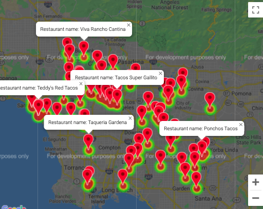
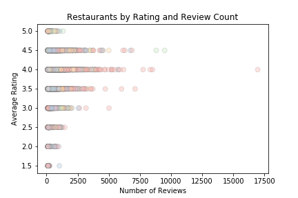
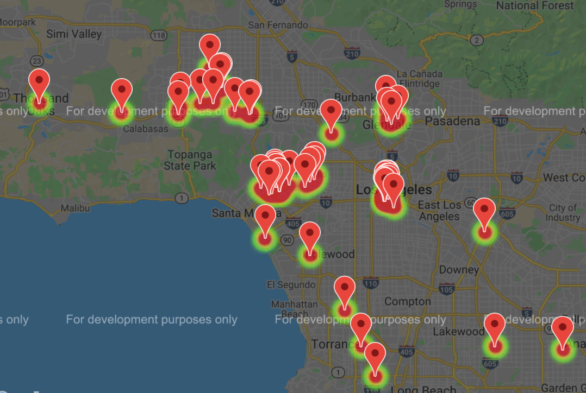
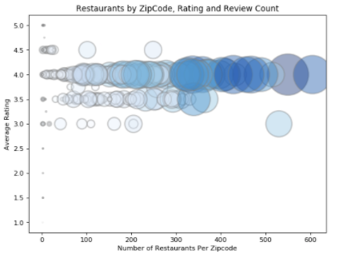

# Stars of LA
## Yelp rating stars analyzed for Los Angeles
How many stars is a restaurant in LA likely to get? Which cuisine types have the biggest fan base and what areas tend to have the worst rated eateries? Data provides answers and this project explores the relationship between location, reviews and number of ratings for various cuisine types within Los Angeles. 

### Want a taco?

### About
Munging, expunging, normalization and plotting extracted data using Python programming in coordination with the Yelp API to produce analysis and visualization. Website page illuminating findings and providing an interactive map is in the link below.

### Deployed on Github Pages
Click on this <a href='https://sherirosalia.github.io/Stars-of-LA'><strong>link </strong></a>to see deployment. 

### Relationship between review count and ratings

### Frameworks
 Python Pandas
 Gmaps
 Plotly Graph
 Matplotlib
 HTML and CSS 

 ### Limitation of the dataset
 Data is dependent on what was retrieved from Yelp which does limit the amount of data developers can access and may not be a comprehensive reflection of all Los Angeles establishments. This being said, the number of data points is well above 20k and likely provides a large enough sampling to statistically represent the Los Angeles, California market.

 ### Persian eateries represented citywide.

 
### File Structure
#### docs
Inside of the docs folder are images, HTML and CSS files for the linked page which explaining findings. The link is above and also in the "About" section of this page.
#### csv
- All csv files used for analysis are in 'csv' folder.
- Initial csv file named: 'la_clean.csv' was generated utilizing the Yelp API. The repository for that project is here: <a href="https://github.com/sherirosalia/LA_Restaurants_Yelp_API">LA Restaurants Yelp API</a>, and the findings from that repository are deployed in an interactive map and the link is here: <a href="https://sherirosalia.github.io/LA_Restaurants_Yelp_API/">Los Angeles Restaurants Map</a>.
#### notebooks
- Jupyter .ipynb files in 'noteook' directory clean the data and produce the visualizations.

#### root
- folders as described above
- readme.md
- Readme images are in in docs folder

### The worst?

### Related repositories:
- <a href="https://github.com/sherirosalia/LA_Restaurants_Yelp_API">LA Restaurants Yelp API</a>
- <a href="https://github.com/sherirosalia/Dirty_Rats_Machine_Learning">Dirty Rats Machine Learning</a>
- <a href="https://github.com/sherirosalia/chrome-extension-grub-or-grubby">Chrome Extension Grub or Grubby</a>
- <a href="https://github.com/sherirosalia/data_rats">Data Girls</a>

### Outlier zipcode analyzed.

